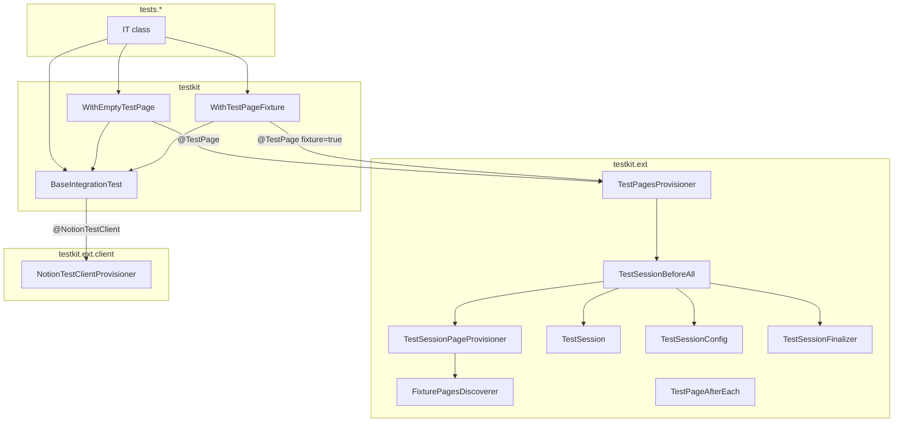
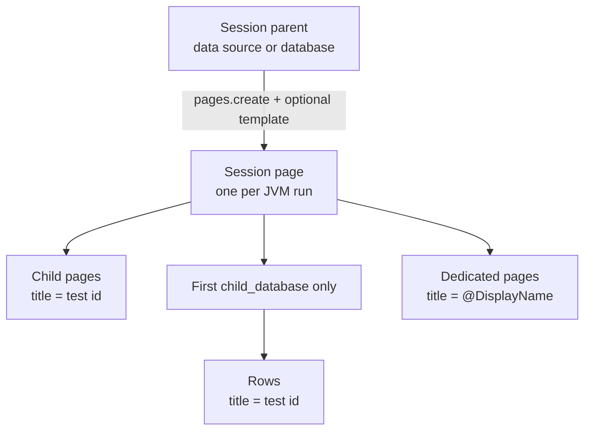
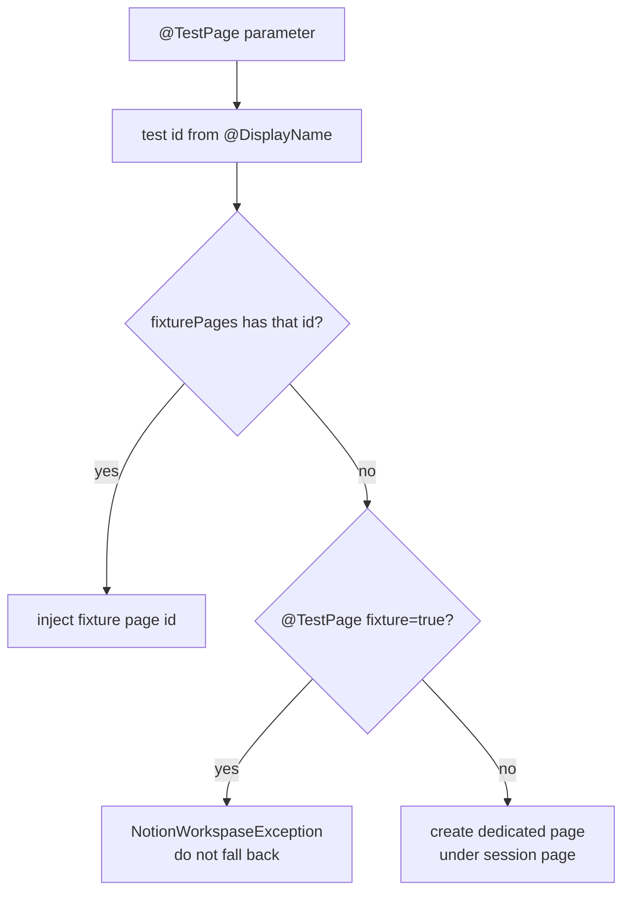

# Integration testkit

Internals of `src/testIntegration/java/testkit`: the JUnit extensions that provision a live Notion
workspace for a run, inject a page and clients into each test, and log inspectable URLs.

How to **write or run** a test is owned by the [Testing Guide](testing-guide.md). This page is for
editing the kit itself — class responsibilities, data shapes, and where a change should land.

## What the kit is for

A run needs a disposable place in the caller's workspace to put pages, plus two `NotionClient`
instances that record HTTP exchanges. Tests must not construct those themselves. The Notion Test
Http Client (`getNotionClient()`, `@NotionTestClient`) matches production JSON defaults unless
`notion.tests.json.strict` is on; the setup client is never strict. The Testing Guide owns that
setting and the reason it is off.

The kit therefore does three jobs:

1. **Session** — once per JVM run, create a session page under a configured parent and discover any
   prefilled fixture pages the template copied in.
2. **Per-test page** — inject either a discovered fixture page or a freshly created dedicated page.
3. **Clients** — inject a Notion Test Http Client and a second client whose exchanges land under
   `test-logs/rqrs/setup`.

## Package map

```
testkit/                      test-facing bases (the only types a test should extend)
testkit/ext/                  JUnit lifecycle + session + page resolution
testkit/ext/client/           NotionClient parameter injection
testkit/util/                 test-id parsing, URL formatting, file upload, config lookup
testkit/test/                 kit unit tests (compiled here; see Gradle filter below)
```

`./gradlew testIntegration` includes only `tests.*`. Classes under `testkit.test` compile with the
source set but are not executed by that task.



## Workspace model

The session parent is **not** a page. `TestSessionPageProvisioner` resolves
`notion.tests.session.parent.id` by retrieving it as a [data source](../../CONTEXT.md) first, then
falling back to a [database](../../CONTEXT.md). There is no page-parent path.

If a template id is set (and is not the literal `default`), Notion duplicates that page into the
parent. If the parent is a database and no template id is set, the database's default template is
used. A data-source parent with no template id creates an empty session page.

Template content is applied asynchronously — see [Notion API constraints](notion-api-constraints.md).
The provisioner polls with `TemplatePoller.awaitAnyBlocks` (15 s timeout, 500 ms interval) before
discovering fixtures.



| Object | Created by | Lifetime |
| --- | --- | --- |
| Session parent | Hand-built in the workspace; id is configuration | Permanent |
| Session page | `TestSessionPageProvisioner` | The run; trashed only if cleanup is on |
| Fixture page | Copied from the template (child page or database row) | Lives under the session page |
| Dedicated page | `TestPagesProvisioner` when no fixture matches | Lives under the session page |

## Data shapes

### `TestSession.Data`

Immutable snapshot published once `TestSession.initialize` completes. `TestSession.get()` blocks up
to 60 s for it; a failed init completes the same future exceptionally so waiters fail immediately.

```
TestSession.Data
  sessionPageId : String          page created for this run
  botUserId     : String          session page's createdBy id
  fixturePages  : Map<id, pageId>  test id → page id (defensive copy)
```

`botUserId` is the shared "costs an API read" value the Testing Guide already documents. Do not add
fields here unless several tests need the same extra read.

### `TestSessionConfig`

Resolved by `TestSessionConfig.from(ExtensionContext)` through `TestConfigurationLookup` (env, then
system property, then JUnit platform parameters). Key spelling is normalized; the Testing Guide
owns the setting list. `notion.tests.json.strict` is not a session field — the client provisioner
reads it separately.

```
TestSessionConfig
  parentId        : String   required
  templateId      : String?  null / "default" / a page id
  sessionTitle    : String?  provisioner default: "Integration tests session"
  cleanupEnabled  : boolean  default false
  notionBaseUrl   : String   default https://www.notion.so/
```

### Root `ExtensionContext` store

`TestSessionBeforeAll` writes these on `context.getRoot().getStore(Namespace.GLOBAL)`:

| Key | Type | Why it is there |
| --- | --- | --- |
| `TestSession.Data.class` | `TestSession.Data` | `getOrComputeIfAbsent` so parallel `beforeAll` calls share one init |
| `"session-config"` | `TestSessionConfig` | URL logging and page-id formatting after init |
| `"session-finalizer"` | `TestSessionFinalizer` | `CloseableResource`; `close()` runs when the root store is closed |

`TestSession` is a second, static copy of the same `Data`. JUnit's store makes init idempotent;
`TestSession.get()` is what tests and later extensions actually call. A second `initialize` throws.

## Lifecycle

`@TestPage` registers `TestSessionBeforeAll`, `TestPagesProvisioner` and `TestPageAfterEach`.
`@NotionTestClient` registers only `NotionTestClientProvisioner`.

That split matters: a class that extends `BaseIntegrationTest` and never uses `@TestPage` does
**not** start a session. `TestSession.get()` then waits 60 s and fails. `IT32_Users_ListAll` has
this dependency — it is safe in a full suite (some other class provisioned the session) and not
safe in isolation.

```mermaid
sequenceDiagram
  participant J as JUnit
  participant BA as TestSessionBeforeAll
  participant PP as TestSessionPageProvisioner
  participant FD as FixturePagesDiscoverer
  participant TS as TestSession
  participant TP as TestPagesProvisioner
  participant NC as NotionTestClientProvisioner
  participant T as Test
  participant FN as TestSessionFinalizer

  J->>BA: beforeAll (first @TestPage class)
  BA->>BA: TestSessionConfig.from(context)
  BA->>PP: provision(config)
  PP->>PP: create session page + poll template
  PP->>FD: discoverFixturePages(blocks)
  FD-->>PP: Map testId → pageId
  PP-->>BA: TestSession.Data
  BA->>TS: initialize(data)
  BA->>J: put session-finalizer on root store

  J->>NC: resolve @NotionTestClient
  NC-->>T: Notion Test Http Client + setup client
  J->>TP: resolve @TestPage
  TP->>TS: get()
  TP->>TP: fixture lookup or create dedicated page
  TP-->>T: page id

  T->>T: @Test

  J->>FN: CloseableResource.close()
  FN->>FN: log session URL; optional moveToTrash
```

## Page resolution

`TestPagesProvisioner` extracts a test id from the method `@DisplayName` via
`NotionTestIdRetriever` (`(?i)\bIT-(?:\d+|\?+)`, then uppercased). `IT-8`, `IT-?` and `IT-??` match;
`IT-abc` does not. The Testing Guide owns the display-name convention; the regex is the contract
the kit actually enforces.



Discovery (`FixturePagesDiscoverer`) does **not** apply the `IT-*` regex. Every non-blank child-page
title and every non-blank title of a row in the **first** `child_database` becomes a map key. A
database row overwrites a child page with the same title. Titles must therefore be exactly the test
id (`IT-8`), not `IT-8: Templates`.

There is an in-code TODO to drop standalone child-page fixtures once the API can express everything
as a data source.

The session page itself is never injected as the test page. Javadoc on `@TestPage` that mentions a
"shared session page" is stale.

## Clients

`NotionTestClientProvisioner` builds every client with `NOTION_TESTS_AUTH_TOKEN` via
`ConfigurationLookup`. The Notion Test Http Client (`@NotionTestClient`) turns on
`FAIL_ON_UNKNOWN_PROPERTIES` only when `TestConfigurationLookup` resolves
`notion.tests.json.strict` to `true`; unset and empty values are `false`. Setup and infra clients
always pass `strictJson = false`, so provisioning cannot fail on an unmodelled field. Instances are
not cached — each resolution constructs a new `NotionClient`.

| Injection | Log directory | Use |
| --- | --- | --- |
| `@NotionTestClient` | `test-logs/rqrs/<test class simple name>` | Notion Test Http Client |
| `@NotionTestClient(forSetup = true)` | `test-logs/rqrs/setup` | Arrange-only calls |
| `getInfraSetupClient()` | same setup directory | Session and page provisioners |

Exchange file format is owned by [Exchange Recording](exchange-recording.md).

## Class responsibilities

### Test-facing bases

- **`BaseIntegrationTest`** — injects the two clients. No page. Enough for users and most file
  uploads.
- **`WithEmptyTestPage`** — `@TestPage` (fixture flag off). Dedicated page unless a fixture happens
  to exist for that id.
- **`WithTestPageFixture`** — `@TestPage(fixture = true)` and tag `fixture`. Missing fixture is a
  hard failure.

A new "needs X" base should stay this thin: a `@BeforeEach` parameter plus a getter. Lifecycle
belongs on the annotation's `@ExtendWith` list, not in the base.

### Session (once per run)

- **`TestSessionBeforeAll`** — JUnit entry. Resolves config, delegates provisioning, publishes
  `TestSession.Data`, registers the finalizer. Package-private constructor exists for unit tests
  with mocks.
- **`TestSessionPageProvisioner`** — creates the session page, waits for template blocks, asks the
  discoverer for fixtures. Parent and template resolution live here.
- **`FixturePagesDiscoverer`** — walks session-page blocks. Child pages plus the first child
  database. The place to add another discovery source.
- **`TestSession`** — static holder + thread-local "current page" (intended for parallel runs;
  parallel execution is off because of `409` — see the Testing Guide). It does **not** resolve
  config or clean up, despite older javadoc.
- **`TestSessionConfig`** — immutable settings object.
- **`TestSessionFinalizer`** — logs the session URL; optionally `pages().moveToTrash`. The
  documented hook for "when the run is over" work (upload results, write stats).

### Per-test page

- **`@TestPage`** — parameter annotation; wires the three extensions above.
- **`TestPagesProvisioner`** — `ParameterResolver` for `@TestPage String`. Owns the
  fixture-or-create decision.
- **`TestPageAfterEach`** — intended to log the test page URL and clear the thread-local. See
  [Wiring gaps](#wiring-gaps).

### Clients and utilities

- **`@NotionTestClient` / `NotionTestClientProvisioner`** — `ParameterResolver` for
  `NotionClient`. Applies `notion.tests.json.strict` to the Notion Test Http Client only. The
  annotation's javadoc is a leftover copy of `@TestPage` and is wrong.
- **`TestConfigurationLookup`** — env / system property / JUnit parameter lookup used by
  `TestSessionConfig` and the client provisioner.
- **`NotionTestIdRetriever`** — display-name → test id. Covered by `testkit.test.NotionTestIdRetrieverTest`.
- **`NotionPageUrlResolver`** — `baseUrl` + hyphen-stripped page id.
- **`FileLoader`** — classpath resource → file upload via the setup client. Fixture files live under
  `src/testIntegration/resources/`.
- **`NotionWorkspaseException`** — unchecked failure for missing fixture / missing test id / missing
  config. The typo is the actual type name.

## Extension points

| If you need to… | Change |
| --- | --- |
| Give tests a new injected prerequisite (a second page, a data source id) | New parameter annotation + `ParameterResolver`, registered on that annotation. Keep the base class to a field + getter. |
| Need a page that cannot be created through the API | Child page or database row on the session template, titled as the test id; extend `WithTestPageFixture`. |
| Discover fixtures from a new place (second database, a data source block) | `FixturePagesDiscoverer` only. |
| Share another rarely-changing id across tests | Field on `TestSession.Data`, populated in `TestSessionPageProvisioner`. Do not add one for a single test. |
| Run work at the end of the suite | `TestSessionFinalizer.close()`. |
| Add a configuration knob | Read it through `TestConfigurationLookup`. Session-provisioning keys also belong on `TestSessionConfig`. Document the setting in the Testing Guide, not here. |
| Start a session for tests that have no page | Register `TestSessionBeforeAll` on `@NotionTestClient` (or a dedicated annotation). Today only `@TestPage` starts the session. |
| Change how a parent id is classified | `TestSessionPageProvisioner.resolveParent` / `resolveTemplate`. |
| Change the test-id grammar | `NotionTestIdRetriever` and its tests; then the Testing Guide display-name rule. |

## Wiring gaps

These are unfinished or stale. Read them before assuming a hook already works.

- **`TestSession.setCurrentPage` is never called.** `TestPageAfterEach` therefore always sees
  `null` and skips URL logging. The intended write is in `TestPagesProvisioner` after it resolves
  an id.
- **`"session-config"` is stored on the root store**, but `TestPagesProvisioner` and
  `TestPageAfterEach` read `context.getStore(...)` (the current context). Treat the root store as
  the source of truth when touching this.
- **`TestBeforeEach` is an empty `BeforeEachCallback`.** Not registered on any annotation.
- **`PathSanitizer` is unused.** Exchange-log directories currently use the raw class simple name.
- **Stale javadoc:** `@NotionTestClient` describes page resolution; `TestSession` claims it resolves
  config and cleans up; `@TestPage` mentions a shared session page that is never injected.

## See also

- [Testing Guide](testing-guide.md) — how to run the suite and write a test
- [Exchange Recording](exchange-recording.md) — files under `test-logs/rqrs/`
- [Notion API constraints](notion-api-constraints.md) — template polling, `409` on concurrent writes
- [Integration tests prompt](../../.github/prompts/integration_tests.prompt.md) — agent launcher
