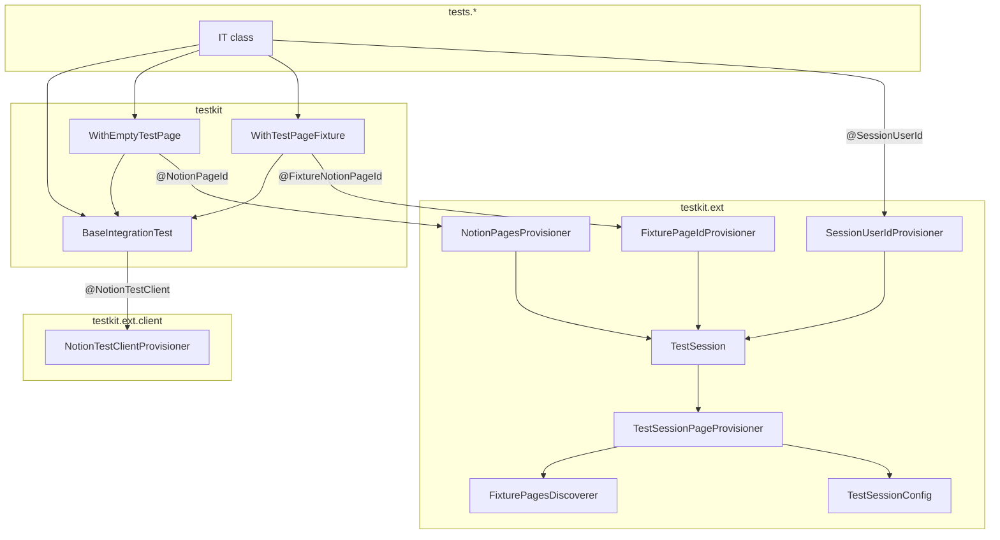
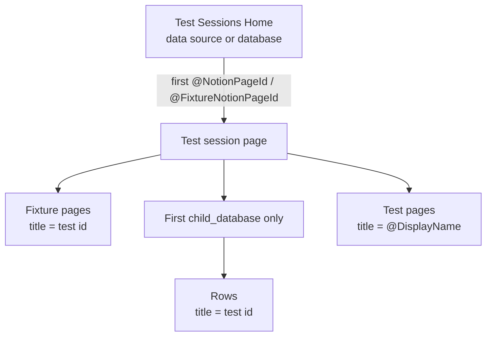
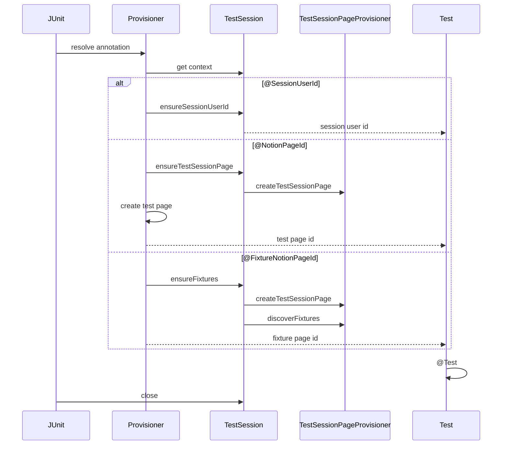
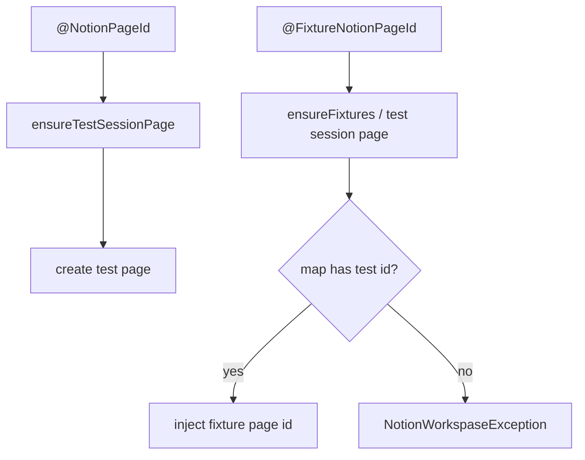

# Integration testkit

Internals of `src/testIntegration/java/testkit`: the JUnit extensions that provision a live Notion
workspace for a run, inject a page and clients into each test, and log inspectable URLs.

How to **write or run** a test is owned by the [Testing Guide](testing-guide.md). Terms used here
are defined in [CONTEXT.md](../../CONTEXT.md). This page is for editing the kit itself — class
responsibilities, data shapes, and where a change should land.

## What the kit is for

A run needs a disposable place in the caller's workspace to put pages, plus two `NotionClient`
instances that record HTTP exchanges. Tests must not construct those themselves. The Notion Test
Http Client (`getNotionClient()`, `@NotionTestClient`) matches production JSON defaults unless
`notion.tests.json.strict` is on; the setup client is never strict. The Testing Guide owns that
setting and the reason it is off.

The kit therefore does three jobs:

1. **Prerequisites** — each injected value has its own annotation and provisioner. Run-scoped
   values (session user id, test session page, fixture pages) are singletons on `TestSession`. Tests
   never call `TestSession`; provisioners do, via `TestSession.get(context)`.
2. **Per-test page** — `@NotionPageId` creates a test page under the test session page;
   `@FixtureNotionPageId` looks up the fixture page named after the test id.
3. **Clients** — inject a Notion Test Http Client and a second client whose exchanges land under
   `test-logs/rqrs/setup`.

## Package map

```
testkit/                      test-facing bases (the only types a test should extend)
testkit/ext/                  JUnit lifecycle + session + page resolution
testkit/ext/client/           NotionClient parameter injection
testkit/util/                 test-id parsing, URL formatting, file upload, config lookup
testkit/test/                 kit unit tests (compiled here; see Gradle filter below)
```

`./gradlew testIntegration` includes only `tests.*`. Classes under `testkit.test` compile with the
source set but are not executed by that task.



## Workspace model

The [Test Sessions Home](../../CONTEXT.md) (also test session parent) is the configured location
under which the test session page is created. `TestSessionPageProvisioner` resolves
`notion.tests.session.parent.id` by retrieving it as a [data source](../../CONTEXT.md) first, then
falling back to a [database](../../CONTEXT.md). There is no page-parent path.

The [test session page](../../CONTEXT.md) is created under the Test Sessions Home. If a template id
is set (and is not the literal `default`), Notion duplicates that page into the home. If the home
is a database and no template id is set, the database's default template is used. A data-source
home with no template id creates a page without an explicit template.

Template content is applied asynchronously — see [Notion API constraints](notion-api-constraints.md).
The provisioner polls with `TemplatePoller.awaitAnyBlocks` (15 s timeout, 500 ms interval) before
discovering fixture pages. Tests that only need a test page never wait for that.



| Object | Created by | Lifetime |
| --- | --- | --- |
| Test Sessions Home | Hand-built in the workspace; id is configuration | Permanent |
| Test session page | `ensureTestSessionPage` — first page prerequisite | The run; trashed only if cleanup is on |
| Fixture page | Copied from the template (child page or database row) | Lives under the test session page |
| Test page | `NotionPageIdProvisioner` for `@NotionPageId` | Lives under the test session page |

## Data shapes

### `TestSession`

`TestSession.get(context)` is the provisioner entry point. The first call puts one instance on the
root store (`getOrComputeIfAbsent`). Prerequisites are filled in when their provisioner first asks.

```
TestSession
  sessionUserId      : String?           users().me() — @SessionUserId
  testSessionPageId  : String?           test session page — @NotionPageId / @FixtureNotionPageId
  fixturePages       : Map<id, pageId>   test id → fixture page
```

### `TestSessionConfig`

Resolved by `TestSessionConfig.from(ExtensionContext)` through `TestConfigurationLookup` when a
**page** prerequisite starts — so a session-user-only test does not need a parent id. Key spelling is
normalized; the Testing Guide owns the setting list. `notion.tests.json.strict` and
`notion.links.base.url` are not session-provisioning fields. Cleanup is read when the session
object is first created.

```
TestSessionConfig
  parentId        : String   required when a page prerequisite starts
  templateId      : String?  null / "default" / a page id
  sessionTitle    : String?  test session page default: "Integration tests session"
  cleanupEnabled  : boolean  default false
```

### Root `ExtensionContext` store

| Key | Type | Why it is there |
| --- | --- | --- |
| `TestSession.class` | `TestSession` | Singleton prerequisites + `CloseableResource` for suite-end cleanup |

## Lifecycle

Each annotation's provisioner calls `TestSession.get(context)`, then ensures only the prerequisite
it owns. `@NotionPageId` depends on the test session page; `@FixtureNotionPageId` depends on the
test session page and then discovers fixture pages.



## Page resolution

`NotionPageIdProvisioner` and `FixturePageIdProvisioner` extract a test id from the method
`@DisplayName` via `NotionTestIdRetriever` (`(?i)\bIT-(?:\d+|\?+)`, then uppercased). `IT-8`,
`IT-?` and `IT-??` match; `IT-abc` does not. The Testing Guide owns the display-name convention.



Discovery (`FixturePagesDiscoverer`) does **not** apply the `IT-*` regex. Every non-blank child-page
title and every non-blank title of a row in the **first** `child_database` becomes a map key. A
database row overwrites a child page with the same title. Titles must therefore be exactly the test
id (`IT-8`), not `IT-8: Templates`.

There is an in-code TODO to drop standalone child-page fixtures once the API can express everything
as a data source.

The test session page is not injected as the test page.

## Clients

`NotionTestClientProvisioner` builds every client with `NOTION_TESTS_AUTH_TOKEN` via
`ConfigurationLookup`. The Notion Test Http Client (`@NotionTestClient`) turns on
`FAIL_ON_UNKNOWN_PROPERTIES` only when `TestConfigurationLookup` resolves
`notion.tests.json.strict` to `true`; unset and empty values are `false`. Setup and infra clients
always pass `strictJson = false`, so provisioning cannot fail on an unmodelled field. Instances are
not cached — each resolution constructs a new `NotionClient`.

| Injection | Log directory | Use |
| --- | --- | --- |
| `@NotionTestClient` | `test-logs/rqrs/<test class simple name>` | Notion Test Http Client |
| `@NotionTestClient(forSetup = true)` | `test-logs/rqrs/setup` | Arrange-only calls |
| `getInfraSetupClient()` | same setup directory | Session and page provisioners |

Exchange file format is owned by [Exchange Recording](exchange-recording.md).

## Class responsibilities

### Test-facing bases

- **`BaseIntegrationTest`** — injects the two clients. No page. Enough for users and most file
  uploads.
- **`WithEmptyTestPage`** — `@NotionPageId`. Test page under the test session page.
- **`WithTestPageFixture`** — `@FixtureNotionPageId` and tag `fixture`. Missing fixture page is a
  hard failure.

A new "needs X" base should stay this thin: a `@BeforeEach` parameter plus a getter. Lifecycle
belongs on the annotation's `@ExtendWith` list, not in the base.

### Prerequisites (annotation + provisioner)

- **`@SessionUserId` / `SessionUserIdProvisioner`** — session user id, once per run.
- **`@NotionPageId` / `NotionPageIdProvisioner`** — test page. Depends on `ensureTestSessionPage`.
- **`@FixtureNotionPageId` / `FixturePageIdProvisioner`** — fixture page named after the test id.
  Depends on `ensureFixtures`.

### Session store

- **`TestSession`** — `get(context)` for provisioners only. Lazy singletons + `close()`.
- **`TestSessionPageProvisioner`** — Notion calls: `createTestSessionPage` and `discoverFixtures`.
- **`FixturePagesDiscoverer`** — walks test session page blocks.
- **`TestSessionConfig`** — parent / template / title; loaded when a page prerequisite starts.
- **`NotionPage`** — logs the injected page URL when the class store closes.

### Clients and utilities

- **`@NotionTestClient` / `NotionTestClientProvisioner`** — `ParameterResolver` for
  `NotionClient`. Applies `notion.tests.json.strict` to the Notion Test Http Client only. Does not
  start a session.
- **`TestConfigurationLookup`** — env / system property / JUnit parameter lookup used by
  `TestSessionConfig` and the client provisioner.
- **`NotionTestIdRetriever`** — display-name → test id. Covered by `testkit.test.NotionTestIdRetrieverTest`.
- **`NotionPageUrlResolver`** — `notion.links.base.url` + hyphen-stripped page id.
- **`FileLoader`** — classpath resource → file upload via the setup client. Fixture files live under
  `src/testIntegration/resources/`.
- **`NotionWorkspaseException`** — unchecked failure for missing fixture / missing test id / missing
  config. The typo is the actual type name.

## Extension points

| If you need to… | Change |
| --- | --- |
| Give tests a new injected prerequisite (a second page, a data source id) | New parameter annotation + `ParameterResolver`, registered on that annotation. Keep the base class to a field + getter. |
| Need a page that cannot be created through the API | Child page or database row on the session template, titled as the test id; extend `WithTestPageFixture`. |
| Discover fixtures from a new place (second database, a data source block) | `FixturePagesDiscoverer` only. |
| Share another rarely-changing id across tests | New annotation + provisioner that calls `TestSession.get(context)` and stores a singleton field. Tests must not call `TestSession`. |
| Run work at the end of the suite | `TestSession.close()`. |
| Add a configuration knob | Read it through `TestConfigurationLookup`. Session-provisioning keys also belong on `TestSessionConfig`. Document the setting in the Testing Guide, not here. |
| Change how a parent id is classified | `TestSessionPageProvisioner.resolveParent` / `resolveTemplate`. |
| Change the test-id grammar | `NotionTestIdRetriever` and its tests; then the Testing Guide display-name rule. |

## Wiring gaps

These are unfinished or stale. Read them before assuming a hook already works.

- **`PathSanitizer` is unused.** Exchange-log directories currently use the raw class simple name.

## See also

- [Testing Guide](testing-guide.md) — how to run the suite and write a test
- [Exchange Recording](exchange-recording.md) — files under `test-logs/rqrs/`
- [Notion API constraints](notion-api-constraints.md) — template polling, `409` on concurrent writes
- [Integration tests prompt](../../.github/prompts/integration_tests.prompt.md) — agent launcher
